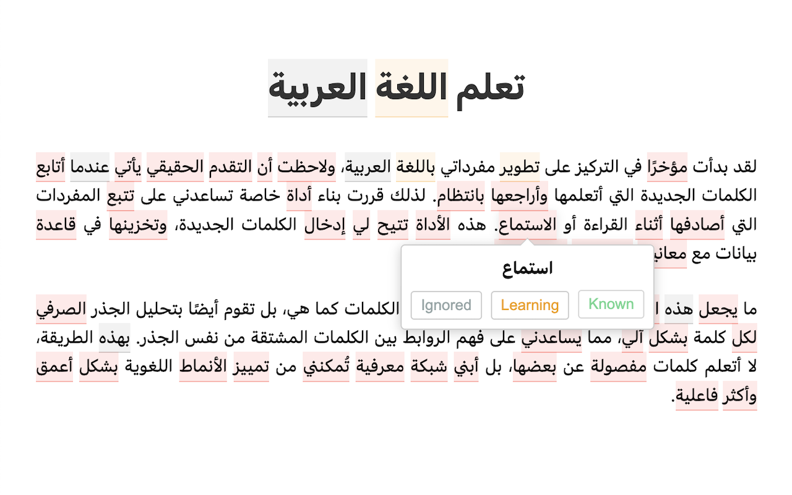
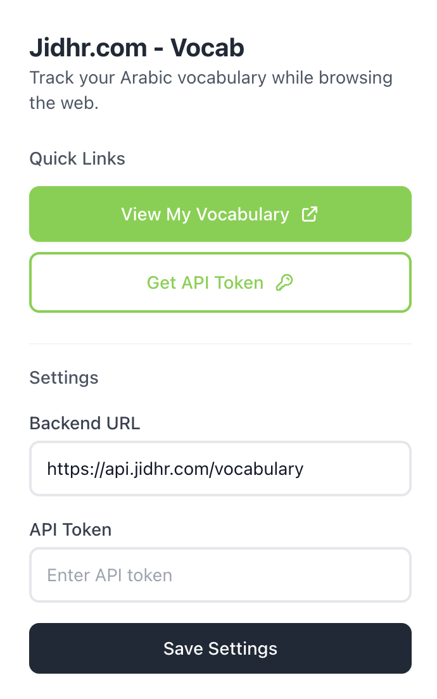

# Jidhr.com - Arabic Vocabulary Tracker

_Note: This project is currently a work in progress_

A browser extension and backend service that helps you track and expand your Arabic vocabulary while browsing the internet. The system processes Arabic text you encounter, allowing you to mark words as known or to-learn, building your personalized vocabulary database.

**Website**: [jidhr.com](https://jidhr.com)

## Overview

The project consists of two main components:

1. **Chrome Extension** (`/chrome-extension`):
   A browser plugin that:

   - Processes selected Arabic text on any webpage
   - Shows lemmatized forms of words
   - Allows marking words as known/to-learn
   - Tracks your vocabulary progress
   - Can be configured to use either the hosted or self-hosted backend

2. **Rust Backend (Optional)** (`/server`):
   - Provides lemmatization services using Farasa
   - Stores vocabulary data in SQLite
   - Offers REST API endpoints for the extension
   - Can be self-hosted for privacy

## Hosted Service

A hosted version of the backend is available at `jidhr.com/vocab`. This is the easiest way to get started, as it requires no setup beyond installing the Chrome extension.

### Connecting to the Hosted Service

1. Sign up or login to jidhr.com
2. Open the extension popup and click on "Get API token"
3. You will be redirected to jidhr.com/vocab
4. Use the button provided to set your API key in the plugin

On jidhr.com/vocab, you can also view a comprehensive overview of your vocabulary progress.

## Self-Hosting

For users who prefer to maintain their privacy by hosting their own backend:

1. Follow the setup instructions in `/server/README.md`
2. Configure the Chrome extension to use your self-hosted backend URL
3. Ensure your hosting environment meets all backend requirements (Rust, Java, SQLite)

Note: The self-hosted version does not require an API key - simply point the extension to your backend URL and you're ready to go.

### Tracked Vocabulary

The self-hosted backend provides the following endpoints for vocabulary access:

- `GET /vocabulary` - Retrieve complete vocabulary list
- `GET /vocabulary/:status` - Filter vocabulary by status (e.g., `/vocabulary/known`)

Note: While the self-hosted version currently doesn't provide a web interface for vocabulary overview, all data can be accessed through these API endpoints.

## Features

- Process Arabic text from any webpage through text selection
- Lemmatization of Arabic words using Farasa
- Mark words as known or to-learn
- Track vocabulary progress over time
- Privacy-focused with self-hosting option
- Persistent vocabulary storage
- Simple and intuitive browser interface

## Getting Started

### Chrome Extension

1. Install the extension from the Chrome Web Store (link coming soon)
2. Click the extension icon to configure:
   - Choose between hosted service or custom backend URL
   - Set your preferences for text processing
   - Configure vocabulary tracking options

### Backend (Self-Hosting)

See `/server/README.md` for detailed backend setup instructions, including:

- Rust environment setup
- Farasa installation
- Database configuration
- API endpoint configuration

## Contributing and Support

Contributions are welcome! Please feel free to submit a Pull Request. For issues and feature requests, please use the GitHub issue tracker.

## License

MIT License

Copyright (c) 2024 Arabic Vocabulary Tracker

Permission is hereby granted, free of charge, to any person obtaining a copy
of this software and associated documentation files (the "Software"), to deal
in the Software without restriction, including without limitation the rights
to use, copy, modify, merge, publish, distribute, sublicense, and/or sell
copies of the Software, and to permit persons to whom the Software is
furnished to do so, subject to the following conditions:

The above copyright notice and this permission notice shall be included in all
copies or substantial portions of the Software.

THE SOFTWARE IS PROVIDED "AS IS", WITHOUT WARRANTY OF ANY KIND, EXPRESS OR
IMPLIED, INCLUDING BUT NOT LIMITED TO THE WARRANTIES OF MERCHANTABILITY,
FITNESS FOR A PARTICULAR PURPOSE AND NONINFRINGEMENT. IN NO EVENT SHALL THE
AUTHORS OR COPYRIGHT HOLDERS BE LIABLE FOR ANY CLAIM, DAMAGES OR OTHER
LIABILITY, WHETHER IN AN ACTION OF CONTRACT, TORT OR OTHERWISE, ARISING FROM,
OUT OF OR IN CONNECTION WITH THE SOFTWARE OR THE USE OR OTHER DEALINGS IN THE
SOFTWARE.

## Technical Stack

- **Frontend**: Chrome Extension (JavaScript)
- **Backend**:
  - Rust with Axum framework
  - Farasa for Arabic lemmatization
  - SQLite for data storage
